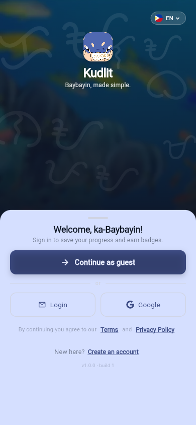
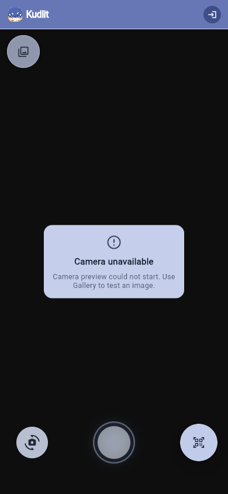
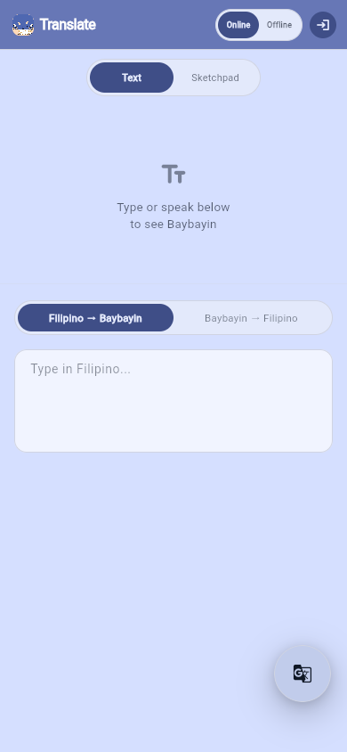
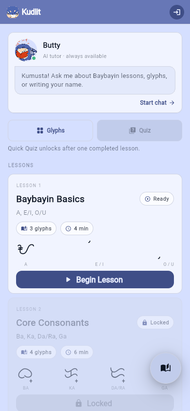
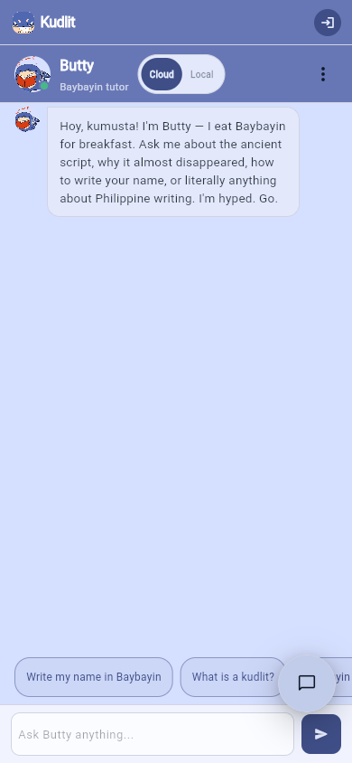

# Kudlit

<p align="center">
  
</p>

<h3 align="center">Learn, read, and translate Baybayin with a mobile-first Filipino learning companion.</h3>

<p align="center">
  <a href="https://github.com/ACSADians/kudlit-app/releases/tag/v1.0.0"><strong>Download Android v1.0.0</strong></a>
  ·
  <a href="Kudlit%20Design%20System/README.md">Design System</a>
  ·
  <a href="docs/system_audit.md">System Audit</a>
</p>

<p align="center">
  
  
</p>

Kudlit is a Flutter app for Baybayin discovery: scan glyphs, translate Filipino text, practice lessons, and get guidance from Butty, the app's learning companion. It combines a playful Filipino visual identity with practical mobile workflows for learners who want to recognize, write, and understand Baybayin without jumping between separate tools.

## Why Kudlit

- **Scan Baybayin glyphs** with a camera-first scanner on Android and a web preview path for browser testing.
- **Translate in both directions** between Filipino text and Baybayin Unicode, with clearer input surfaces for longer writing.
- **Learn by doing** through lessons, glyph references, quiz surfaces, and sketch-oriented practice flows.
- **Ask Butty for help** through AI-assisted explanation surfaces designed to show user-facing answers, not raw prompt scaffolding.
- **Built mobile first** with responsive auth, scan, translate, learn, profile, settings, and legal flows hardened across portrait and landscape checks.
- **Brand-led interface** using the bundled Kudlit design system, Baybayin display font, and original Butty/learning artwork.

## Release

The current public Android package is available from the GitHub Release:

- **Version:** `v1.0.0`
- **APK:** [`app-release.apk`](https://github.com/ACSADians/kudlit-app/releases/download/v1.0.0/app-release.apk)
- **Verified device metadata:** `versionName=1.0.0`, `versionCode=2`

## Screenshots

<p align="center">
  
  
  
  
  
</p>

## 90-Second Demo Flow

1. **Install:** Open the `v1.0.0` GitHub Release, download the Android APK, and install Kudlit.
2. **Enter:** Start on the branded welcome screen and continue as a guest for the fastest demo path.
3. **Scan:** Open Scan, show the camera/gallery controls, and explain that Kudlit is built for Baybayin recognition with clear fallback states.
4. **Translate:** Switch to Translate, type a Filipino phrase, and show the Baybayin Unicode output flow.
5. **Learn:** Open Learn to show lessons, glyph references, and quiz-oriented practice.
6. **Ask Butty:** Switch to Butty and show the companion as the support layer for explanations and learning guidance.
7. **Close:** Point back to the APK release and the bundled design system as proof that the app is packaged, branded, and ready for hands-on testing.

## Product Surfaces

| Surface | What it does |
|---|---|
| Scan | Camera and gallery-based Baybayin recognition with responsive scanner controls and clear fallback states. |
| Translate | Filipino-to-Baybayin and Baybayin-to-Filipino translation surfaces with copy/share/explain affordances. |
| Learn | Lessons, glyph references, quiz entry points, and mobile-friendly study cards. |
| Butty | Companion guidance for explanations, learning support, and AI-assisted help surfaces. |
| Auth/Profile/Settings | Branded account entry, legal pages, profile polish, and safer navigation patterns. |

## Current Setup

- App shell and auth flow use a shared Flutter design-system layer under `lib/core/design_system/`.
- The bundled Baybayin display font and reference assets are copied into `assets/fonts/` and `assets/brand/` for normal Flutter usage.
- The home shell, scanner, translator, learning, profile, and settings surfaces are active Flutter feature slices using the shared Kudlit visual system.
- The original design-system source remains in [`Kudlit Design System/`](<Kudlit Design System/>) for previews, reference JSX, and asset provenance.

## Tech Stack

| Layer | Technology |
|---|---|
| Framework | Flutter (Dart) |
| State management | Riverpod (`riverpod_annotation`) |
| Routing | `go_router` |
| Backend auth | Supabase |
| Character detection | YOLO → TFLite (`ultralytics_yolo`) |
| Language understanding | Gemma 4 |
| Error handling | `Either<Failure, T>` via `fpdart` |

## Getting Started

```bash
flutter doctor
flutter pub get
flutter run -d chrome
```

Useful commands:

```bash
flutter analyze
flutter test
flutter build web
dart format lib/ test/
```

## Deployment

The repository includes two web deployment paths:

- `build.sh` for Cloudflare Pages. Configure the build command as `bash build.sh` and the output directory as `build/web`.
- `.github/workflows/deploy-pages.yml` for GitHub Pages. It runs on pushes to `main` and can also be started manually from GitHub Actions.

Both deployment paths expect these repository or platform secrets:

- `SUPABASE_URL`
- `SUPABASE_ANON_KEY`
- `GEMINI_API_KEY`
- `HUGGINGFACE_TOKEN` is optional.

After a deployment is live, smoke-check the main web routes:

```bash
pwsh -NoProfile -ExecutionPolicy Bypass -File scripts/prod-smoke.ps1 -BaseUrl "https://acsadians.github.io/kudlit-app"
```

### Translate Header UI verification

From `kudlit-app/`, run:

```bash
pwsh -NoProfile -ExecutionPolicy Bypass -File scripts/verify-translate-header-ui.ps1
pwsh -NoProfile -ExecutionPolicy Bypass -File scripts/verify-translate-header-ui.ps1 -Tabs "scan,translate,learn,butty" -Widths "768,1024,1366,1920" -SkipTests
```

The script:

- runs `test/features/home/presentation/widgets/translate_density_test.dart` unless `-SkipTests` is set,
- captures screenshots under `test-results/ui-verify/` with names like `translate-header-<tab>-<width>.png`,
- starts a local static preview only if the target URL is not already reachable.

### Translate header UI hardening

```bash
pwsh -NoProfile -ExecutionPolicy Bypass -File scripts/verify-translate-header-ui.ps1
```

Capture-only pass (skip `translate_density_test.dart`):

```bash
pwsh -NoProfile -ExecutionPolicy Bypass -File scripts/verify-translate-header-ui.ps1 -SkipTests
```

Custom capture width set:

```bash
pwsh -NoProfile -ExecutionPolicy Bypass -File scripts/verify-translate-header-ui.ps1 -Widths "768,1024,1366,1920,1536"
```

### Scan layout hardening

```bash
pwsh -NoProfile -ExecutionPolicy Bypass -File scripts/scan-layout-overlap-pass.ps1
```

This strict pass runs `test/features/scanner/presentation/widgets/scan_tab_responsive_matrix_test.dart`, captures matrix and transition screenshots, and writes:

- `qa-artifact/scan-layout-strict-overlap/report.json`
- `qa-artifact/scan-layout-strict-overlap/scan-layout-overlap-contact-sheet.html`
- `qa-artifact/scan-layout-strict-overlap/matrix/`
- `qa-artifact/scan-layout-strict-overlap/transitions/`

Default matrix set in script:

- `360x740`, `390x844`, `430x932`, `844x390`, `1024x768`
- strict tiny stress widths: `340x260`, `320x240`

Transition stress test uses:

- URL query `qa_camera_status=unavail-ready`
- phases: `early`, `mid`, `late`
- waits: 300ms, 1200ms, 2100ms

## Folder Structure

```text
lib/
├── app/                        App bootstrapping, router, app constants
├── core/
│   ├── config/                 Environment and Supabase setup
│   ├── design_system/          Flutter theme, color tokens, shared UI shells
│   ├── error/                  Shared failures and exceptions
│   └── usecases/               Base use case abstractions
├── features/
│   ├── auth/                   Auth feature slice
│   ├── scanner/                Scanner detection, model, and camera logic
│   ├── translator/             AI/chat translation and memory logic
│   └── learning/               Lesson and reference logic
└── main.dart

assets/
├── brand/                      Copied Kudlit illustrations and reference art
└── fonts/                      Baybayin display font used in the UI

Kudlit Design System/           Reference docs, CSS tokens, previews, JSX UI kit
```

## Architecture

The app follows feature-first clean architecture:

- `presentation -> domain <- data`
- `domain` stays pure Dart
- repositories are defined in `domain` and implemented in `data`
- app-wide visual decisions live in `core/design_system/`, not inside feature widgets

Current feature intent:

- `auth`: implemented and now wrapped in the branded Kudlit auth shell
- `scanner`: native live YOLO scanning plus web webcam preview with capture-based TFLite detection from the active vision model URL
- `translator`: active Baybayin transliteration and Gemma-assisted interpretation surfaces
- `learn`: active lessons, quizzes, and reference content

## Design System Notes

- Token source: [`Kudlit Design System/colors_and_type.css`](<Kudlit Design System/colors_and_type.css>)
- Brand guidance: [`Kudlit Design System/README.md`](<Kudlit Design System/README.md>)
- Local repo workflow notes: [SKILL.md](SKILL.md)
- Gemini CLI entrypoint: [GEMINI.md](GEMINI.md)
- Repo-local Gemini frontend skill: [skills/flutter-frontend/SKILL.md](skills/flutter-frontend/SKILL.md)

Important limitation:

- The design docs specify Geist for the UI font, but this repository currently only bundles the Baybayin display font. The shared Flutter theme already applies the Kudlit color, radius, and spacing language, and Baybayin headings use the bundled font directly.

## Gemini CLI Setup

Install `obra/superpowers` in Gemini CLI:

```bash
gemini extensions install https://github.com/obra/superpowers
```

This repository also includes a local Gemini extension:

- [gemini-extension.json](gemini-extension.json)
- [GEMINI.md](GEMINI.md)
- [skills/flutter-frontend/SKILL.md](skills/flutter-frontend/SKILL.md)

Recommended usage:

- Use `obra/superpowers` for process skills such as brainstorming, planning, debugging, TDD, and review
- Use the local `flutter-frontend` skill for Kudlit-specific Flutter UI and design-system implementation

## Working Rules

- Keep UI mobile-first even when using Chrome as the design target.
- Do not bypass `core/design_system/` for shared colors, type, surfaces, or brand assets.
- Keep widgets focused on display; move business logic into Riverpod notifiers and use cases.
- Prefer relative imports within a feature and `package:kudlit_ph/...` across features.
- Use single quotes and explicit types.

For repo-level coding rules and architecture constraints, read [CLAUDE.md](CLAUDE.md).
